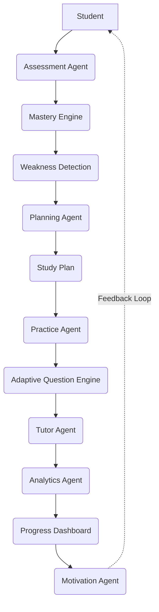

# AI Architecture Workflow

The following diagram illustrates the core AI pipeline from the student's initial assessment through continuous feedback and motivation.

### Components

* **Student**: The end-user interacting with the platform.
* **Assessment Agent**: Evaluates the student's current proficiency level.
* **Mastery Engine**: Tracks knowledge acquisition and conceptual mastery.
* **Weakness Detection**: Identifies specific knowledge gaps.
* **Planning Agent**: Formulates a personalized study trajectory.
* **Study Plan**: The generated schedule and milestone path.
* **Practice Agent**: Delivers contextual practice sessions.
* **Adaptive Question Engine**: Dynamically scales task difficulty based on real-time performance.
* **Tutor Agent**: Provides live, interactive assistance and explanations.
* **Analytics Agent**: Processes performance data into actionable metrics.
* **Progress Dashboard**: The visual interface displaying analytics.
* **Motivation Agent**: Delivers encouragement, achievements, and behavioral nudges to keep the student engaged.
