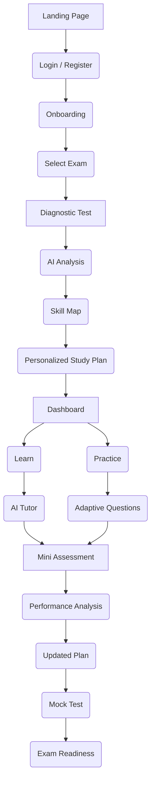

# Core Application User Journey

The following flowchart outlines the primary user friction-less journey from landing on the application to reaching exam readiness status.

## Journey Phases

1. **Onboarding & Assessment**: The user creates an account, selects their target exam, and immediately takes a diagnostic test.
2. **AI Planning**: The platform analyzes the diagnostic results to build a detailed `Skill Map` outlining weak and strong areas, finishing with a generated `Personalized Study Plan`.
3. **Core Loop (Learn & Practice)**: The user accesses the `Dashboard` and cycles between Learning (with an `AI Tutor`) and Practicing (`Adaptive Questions`).
4. **Evaluation**: Iteration is verified through `Mini Assessments` leading to `Performance Analysis`.
5. **Mastery Validation**: The `Updated Plan` scales the user towards a full-length `Mock Test`, ultimately evaluating their final `Exam Readiness`.
