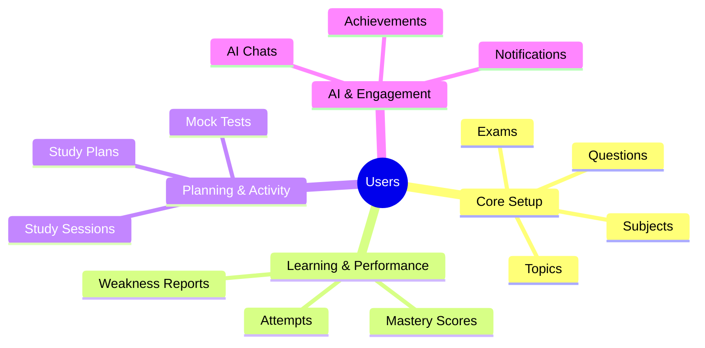

# Database Architecture

## High-Level Entity Relationships

The primary data entity is the **User** (Student), which branches out into various relational models tracking their academic setup, performance, AI interactions, and progress.

## Relational Entity Breakdown

* **Users**: Standard authentication and user profile data.
* **Exams**: Competitive test configurations (e.g., SAT, JEE).
* **Subjects**: Sub-divisions of Exams (e.g., Math, Physics).
* **Topics**: Distinct curriculum units within Subjects.
* **Questions**: The core question bank linked to Topics and difficulty levels.
* **Attempts**: Records of a user's answers to specific Questions.
* **Mastery Scores**: Quantifiable proficiency ratings per Topic based on calculation engines.
* **Weakness Reports**: AI-generated reports highlighting frequent mistake vectors.
* **Study Plans**: AI-generated timelines and schedules linked to a User's Target Score.
* **Study Sessions**: Individual blocks of learning or practice time.
* **AI Chats**: Stores conversation memory between the user and the AI Tutor.
* **Mock Tests**: Full-length exam simulators with stored configuration and results.
* **Notifications**: Alert objects for reminders, nudges, and achievements.
* **Achievements**: Gamification badges and milestone trackers.
